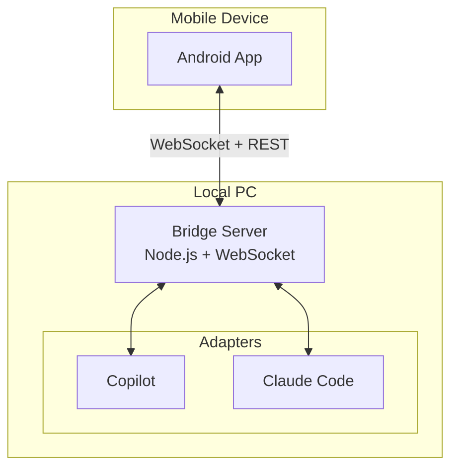

# Leash

**Leash** is a lightweight Android app for monitoring and interacting with AI coding agents (GitHub Copilot, Claude Code) running on your local workstation.

## Architecture



## Components

| Component | Tech Stack | Purpose |
|-----------|-----------|---------|
| **Android App** | Kotlin, Jetpack Compose | Mobile UI for monitoring & interaction |
| **Bridge Server** | Node.js, TypeScript, Express, ws | Local server bridging app and agents |
| **Agent Adapters** | node-pty | Terminal monitoring for each agent type |

## Quick Start

### Server
```bash
cd server
npm install
npm run dev
```

### Android
Open `android/` in Android Studio and run on device/emulator.

## MVP Features

- ✅ See list of connected AI agents
- ✅ View real-time activity from agents
- ✅ Send text messages to agents
- ✅ Connection status indicators

## Project Structure

```
leash/
├── server/           # Bridge server (Node.js)
│   └── src/
│       ├── api/      # REST endpoints
│       ├── websocket/# Real-time communication
│       └── adapters/ # Agent connectors
│
└── android/          # Mobile app (Kotlin)
    └── app/src/main/
        ├── ui/       # Compose screens
        └── data/     # Repository & WebSocket client
```

## License

MIT
