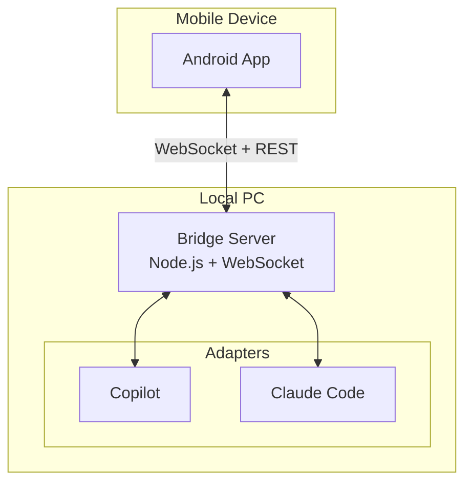

# 🐕 Leash

**Leash** is a lightweight Android app for monitoring and interacting with AI coding agents (GitHub Copilot, Claude Code) running on your local workstation or a VPS.

## Quick Install

### Linux/macOS
```bash
curl -fsSL https://raw.githubusercontent.com/user/leash/main/install.sh | bash
```

### Windows (PowerShell)
```powershell
irm https://raw.githubusercontent.com/user/leash/main/install.ps1 | iex
```

The setup wizard will guide you through:
- **Deployment mode**: Local, VPS, or both
- **Authentication**: Password protection (optional)
- **Custom domain**: For VPS deployments with reverse proxy
- **Claude hooks**: Real-time monitoring integration

### Environment Variables

For VPS deployments, you can configure these in `.env`:

| Variable | Purpose | Example |
|----------|---------|---------|
| `LEASH_PASSWORD` | Authentication password | `your-secure-password` |
| `LEASH_DOMAIN` | Custom domain for VPS | `leash.example.com` |
| `LEASH_EXTERNAL_PORT` | External port (reverse proxy) | `443` |
| `PORT` | Server port | `3001` |

## Architecture



## Prerequisites

### Server Requirements
- **Node.js** 18+ ([Download](https://nodejs.org/))
- **npm** (comes with Node.js)

### Android App Requirements
- **Android Studio** Hedgehog (2023.1.1) or newer ([Download](https://developer.android.com/studio))
- **JDK 17** (bundled with Android Studio)
- **Android SDK 34** (API Level 34)
- **Gradle 8.5** (handled by wrapper)

### For Installing on Device
- **ADB** (Android Debug Bridge, included with Android Studio)
- USB Debugging enabled on your Android device

---

## Quick Start

### 1. Server Setup

```bash
cd server
npm install
npm run dev
```

The server will display a QR code in the terminal:
```
╔════════════════════════════════════════════════════════════╗
║                    🐕 LEASH SERVER                         ║
╠════════════════════════════════════════════════════════════╣
║  Scan this QR code with the Leash mobile app:              ║
╚════════════════════════════════════════════════════════════╝

[QR CODE]

Or connect manually:
   WebSocket URL: ws://192.168.1.x:3000/ws
   REST API:      http://192.168.1.x:3000/api
```

### 2. Android App Setup

#### Option A: Build from Source

```bash
cd android

# Build debug APK
./gradlew assembleDebug

# Install on connected device
adb install app/build/outputs/apk/debug/app-debug.apk
```

#### Option B: Open in Android Studio
1. Open Android Studio
2. Select **File → Open** and choose the `android/` folder
3. Wait for Gradle sync to complete
4. Click **Run** (green play button)

---

## Dependencies

### Server (`server/package.json`)

| Package | Version | Purpose |
|---------|---------|---------|
| `express` | ^4.18.2 | REST API server |
| `ws` | ^8.17.0 | WebSocket server |
| `cors` | ^2.8.5 | Cross-origin requests |
| `qrcode-terminal` | ^0.12.0 | QR code display in console |
| `typescript` | ^5.3.3 | TypeScript compiler |
| `tsx` | ^4.7.0 | TypeScript execution |

### Android (`android/app/build.gradle.kts`)

| Library | Version | Purpose |
|---------|---------|---------|
| Kotlin | 1.9.21 | Programming language |
| Compose BOM | 2023.10.01 | UI framework |
| Material 3 | 1.1.2 | Design system |
| Navigation Compose | 2.7.6 | Screen navigation |
| OkHttp | 4.12.0 | HTTP/WebSocket client |
| Retrofit | 2.9.0 | REST API client |
| Gson | 2.10.1 | JSON parsing |
| Coroutines | 1.7.3 | Async programming |

---

## Project Structure

```
leash/
├── server/                 # Bridge server (Node.js)
│   ├── src/
│   │   ├── index.ts        # Entry point, QR code display
│   │   ├── agent-manager.ts # Agent lifecycle management
│   │   ├── agent-detector.ts # Auto-detect running agents
│   │   ├── api/
│   │   │   └── routes.ts   # REST + hooks endpoints
│   │   ├── websocket/
│   │   │   └── handler.ts  # Real-time communication
│   │   └── adapters/
│   │       ├── base.ts     # Base adapter interface
│   │       ├── claude.ts   # Claude Code adapter
│   │       └── copilot.ts  # GitHub Copilot adapter
│   └── package.json
│
└── android/                # Mobile app (Kotlin)
    ├── app/src/main/
    │   ├── java/com/leash/app/
    │   │   ├── MainActivity.kt
    │   │   ├── data/
    │   │   │   ├── LeashWebSocketClient.kt
    │   │   │   ├── AgentRepository.kt
    │   │   │   └── ConnectionSettings.kt
    │   │   ├── model/
    │   │   │   ├── Agent.kt
    │   │   │   └── AgentActivity.kt
    │   │   └── ui/
    │   │       ├── screens/
    │   │       │   ├── ConnectionScreen.kt
    │   │       │   ├── AgentListScreen.kt
    │   │       │   └── AgentDetailScreen.kt
    │   │       ├── navigation/
    │   │       │   └── NavHost.kt
    │   │       └── theme/
    │   │           ├── Color.kt
    │   │           ├── Theme.kt
    │   │           └── Type.kt
    │   └── res/
    ├── build.gradle.kts
    └── gradle.properties
```

---

## Claude Code Hooks Integration

Leash can monitor Claude Code sessions using Claude Code's built-in hooks system. This provides real-time activity tracking without spawning new processes.

### How It Works

1. Hooks are configured in `.claude/settings.json`
2. Claude Code calls the hook script for lifecycle events (tool use, prompts, etc.)
3. The hook script POSTs events to the Leash server
4. Server broadcasts activity to connected mobile clients

### Supported Events

| Event | Description |
|-------|-------------|
| `SessionStart` | Claude Code session started |
| `UserPromptSubmit` | User submitted a prompt |
| `PreToolUse` | Before a tool is executed |
| `PostToolUse` | After a tool completes |
| `Notification` | System notifications |
| `Stop` | Session ended |

### Setup (Global Configuration)

The hooks are configured globally in your user's Claude Code settings:

1. **Hook Script**: `~/.claude/hooks/leash_hook.js`
2. **Settings**: `~/.claude/settings.json` (hooks section)

The hook script automatically tries multiple hosts (localhost, 127.0.0.1, Docker hosts) to find the Leash server.

---

## Features

### Core
- ✅ QR code connection from server to mobile
- ✅ Manual URL input for connection
- ✅ See list of connected AI agents
- ✅ View real-time activity from agents
- ✅ Send text messages to agents
- ✅ Connection status indicators
- ✅ Dark theme UI
- ✅ Claude Code hooks integration for real-time monitoring

### Chat & Messaging
- ✅ Real-time chat streaming with colored syntax
- ✅ Collapsible diffs (10+ lines auto-collapse, tap to expand)
- ✅ Clipboard messaging (paste code snippets)
- ✅ Message queue with interrupt support
- ✅ Quick "Continue" button for agent prompts

### UX Polish
- ✅ Auto-connect when server URL is configured
- ✅ Dark loading screen (no white flash)
- ✅ Material icons throughout (replaced emojis)
- ✅ Smart date formatting (HH:mm today, MMM d HH:mm older)
- ✅ Instant scroll to latest messages
- ✅ Autopilot mode (auto-send "continue" on Stop events)
- ✅ Settings menu with Autopilot toggle and Disconnect

---

## Troubleshooting

### Server won't start
```bash
# Check Node.js version
node --version  # Should be 18+

# Clear and reinstall dependencies
rm -rf node_modules
npm install
```

### Android build fails
```bash
# Clean build
./gradlew clean
./gradlew assembleDebug

# Check Java version
java -version  # Should be 17+
```

### Device not detected
```bash
# Check connected devices
adb devices

# If empty, enable USB debugging on your phone:
# Settings → Developer Options → USB Debugging → ON
```

### Install fails with USER_RESTRICTED
Enable "Install via USB" in Developer Options on your phone.

---

## License

MIT
